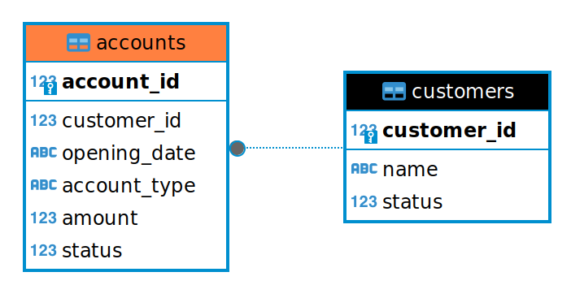

# Ports-Adapter Architecture

The following repository documents my attempt to learn about files architecture in Golang to enhance knowledge in structuring source code. 
I also understand why my attempted to develop a code for previous project failed. I believe due to unorganized and code-coupling that make the development feels like hell.


# ER Diagram



# SQL Script for database

An SQL script for creating tables in SQLite3 database.

```sql
-- Customers table
CREATE TABLE IF NOT EXISTS customers (
    customer_id INTEGER PRIMARY KEY AUTOINCREMENT,
    name        TEXT NOT NULL,
    status      INTEGER
);

-- Accounts table
CREATE TABLE IF NOT EXISTS accounts (
    account_id   INTEGER PRIMARY KEY AUTOINCREMENT,
    customer_id  INTEGER NOT NULL,
    opening_date TEXT NOT NULL,
    account_type TEXT NOT NULL,
    amount       REAL,  -- Use REAL for float64 in SQLite
    status       INTEGER,
    FOREIGN KEY (customer_id) REFERENCES customers(customer_id)
);
```